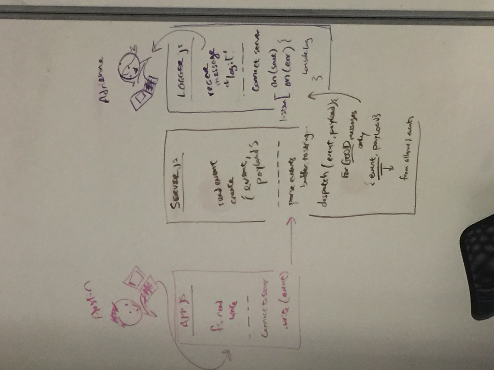

# lab-17-tcp-server-message-application

# LAB - 17

## TCP Server/Message Application

### Author: Adrienne Easton with some mob programming

### Links and Resources
* [submission PR](https://github.com/401-advanced-javascript-aeaston/lab-17-tcp-server-message-application/pull/2)
* [travis]

### Modules
#### server.js

#### logger.js

#### app.js

### Setup
#### `.env` requirements
* npm i

#### Running the app
* node server.js
* node logger.js
* node app.js (file path)
  
#### Tests
* npm test

#### UML
